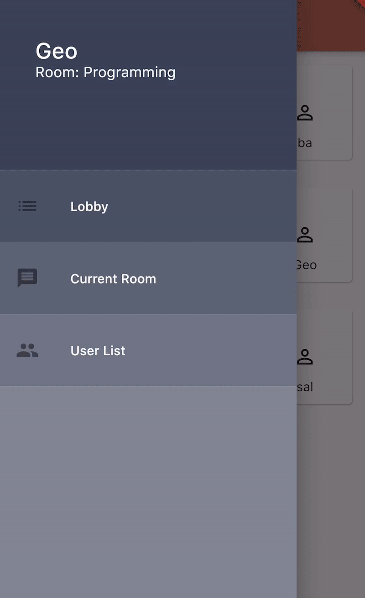
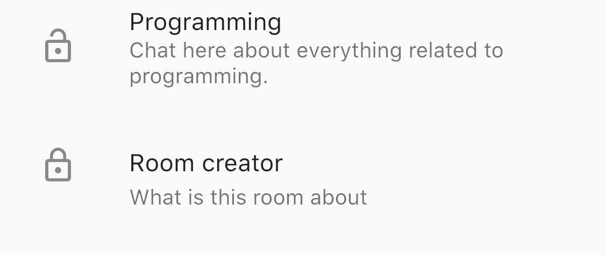
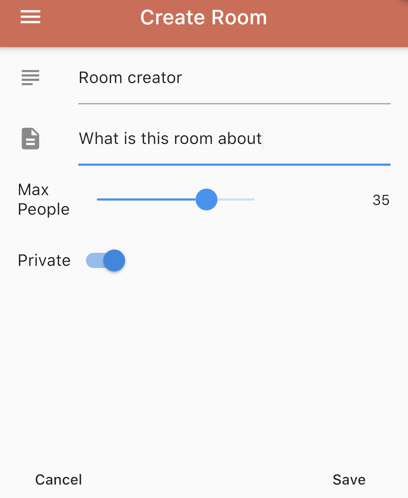
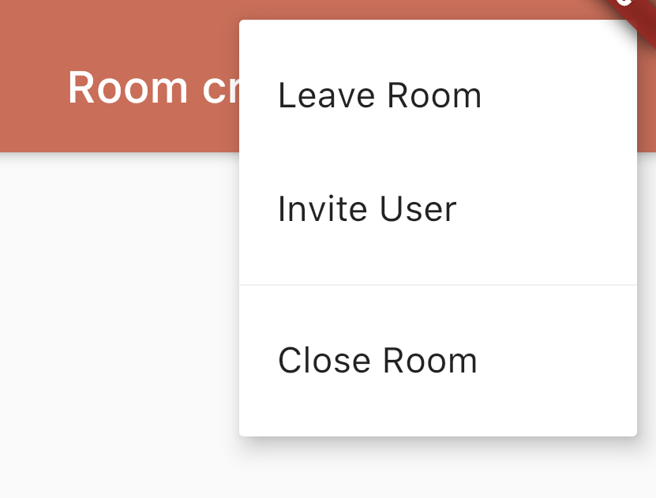
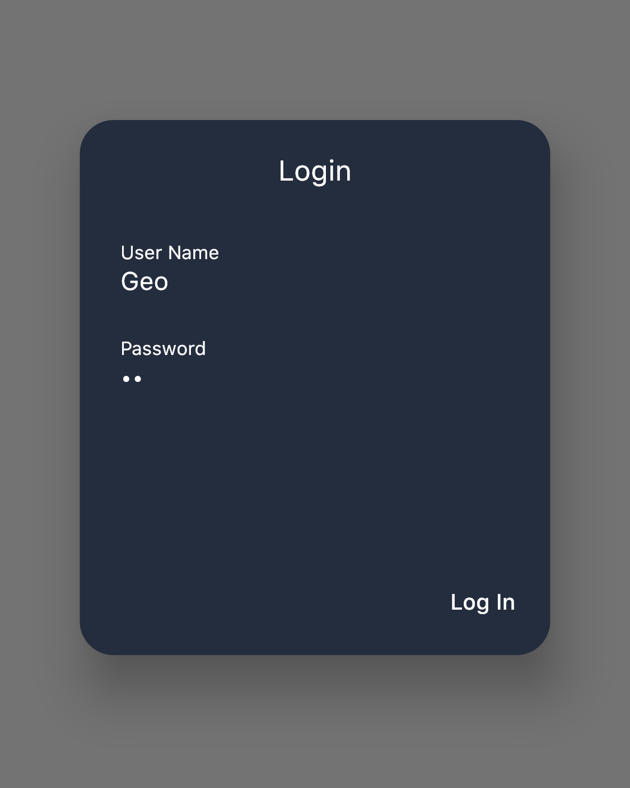

# Color Chat
 Simple chat app made with Flutter, Node and socket.io.
 
 # Example
 
 
 # Features
 
 ## Public and private rooms
  
  
 ## Room creator
  
  
 ## Invites and admin options
  
  
 ## User login and registration
  
  
